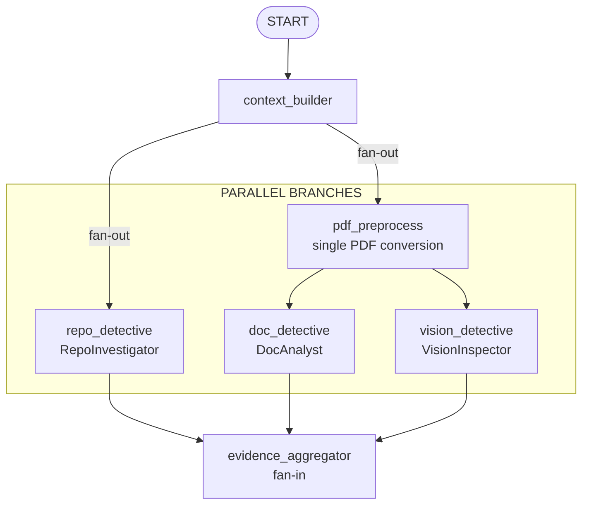
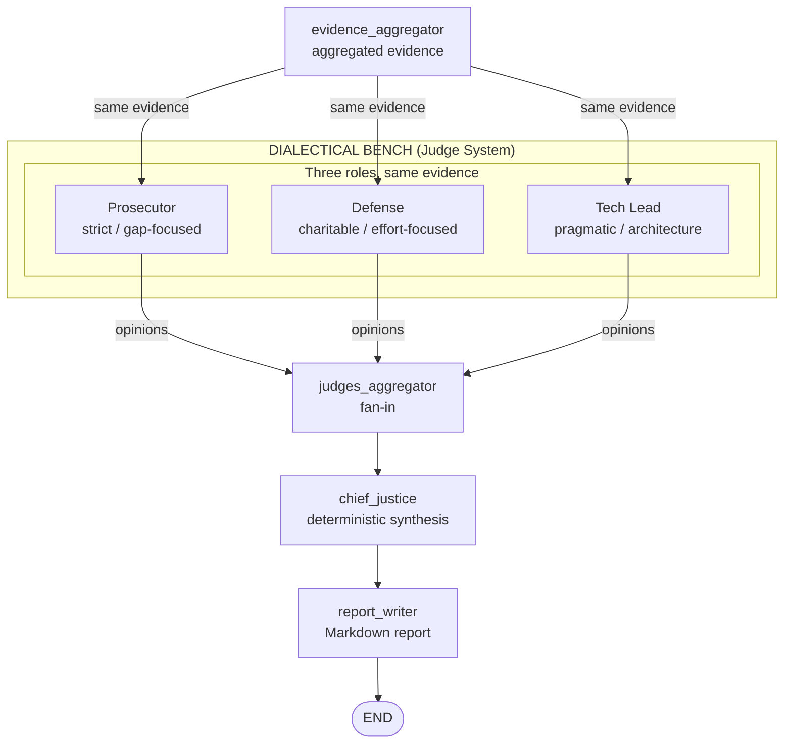
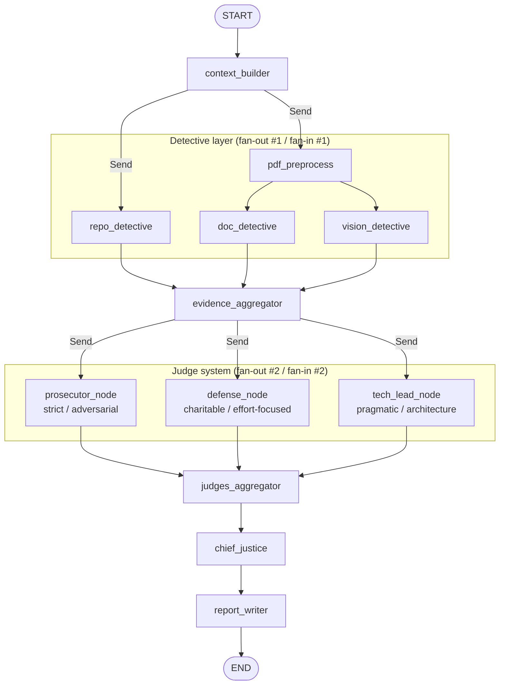

# Automaton Auditor — Architecture & Decisions

This document captures architecture decisions, known gaps with a concrete plan, and the StateGraph flow (with diagrams) for the Digital Courtroom audit system.

---

## Architecture Overview (Two Pillars)

The system is built around two main architectural patterns:

1. **Parallel evidence collection (Detective layer)**  
   After loading the rubric and routing (context_builder), evidence gathering **fans out** so that multiple detectives run **in parallel** on the same inputs: **RepoInvestigator** (clone, AST, git history), **DocAnalyst** (PDF report), and **VisionInspector** (diagrams). PDF is converted once (`pdf_preprocess`), then **doc_detective** and **vision_detective** run in parallel. All detective outputs **fan in** at **evidence_aggregator**, where state reducers merge evidence by source (`repo`, `docs`, `vision`). No detective sees another's output; they produce objective, non-opinionated evidence only.

2. **Judge system (Dialectical Bench) — True Parallel Execution**  
   After evidence is aggregated, the **Dialectical Bench** evaluates it via a **second fan-out/fan-in pattern**: three distinct nodes—**prosecutor_node** (strict, gap-focused), **defense_node** (charitable, effort-focused), and **tech_lead_node** (pragmatic, architecture-focused)—run **in parallel** via `Send()`. Each node produces a **JudicialOpinion** (score, argument, cited evidence) **per rubric criterion**. They all see the **same** evidence; their prompts enforce different lenses (<50% prompt overlap). All opinions **fan in** at **judges_aggregator** (state merged by `operator.add` on `opinions`). The **Chief Justice** (deterministic, no LLM) then applies rules (Rule of Security, Rule of Evidence, functionality weight, dissent handling) to synthesize a final verdict and remediation. The report (Executive Summary, Criterion Breakdown, Remediation Plan) is the output of this synthesis.

The diagrams below make the **two fan-out/fan-in patterns** explicit.

**Theoretical depth (rubric alignment):**

- **Fan-In / Fan-Out** is tied to specific graph edges:
  - **Fan-out #1 (Detectives):** `context_builder` → conditional edges (`Send`) to `repo_detective` and `pdf_preprocess`; `pdf_preprocess` → `Send` to `doc_detective` and `vision_detective`.
  - **Fan-in #1:** `repo_detective`, `doc_detective`, `vision_detective` → `evidence_aggregator` (state merged by `operator.ior` on `evidences` dict).
  - **Fan-out #2 (Judges):** `evidence_aggregator` → `judges_router` returns `[Send("prosecutor_node", state), Send("defense_node", state), Send("tech_lead_node", state)]`.
  - **Fan-in #2:** `prosecutor_node`, `defense_node`, `tech_lead_node` → `judges_aggregator` (state merged by `operator.add` on `opinions` list).
  - See `src/graph.py` and the StateGraph flow in §3.
- **Dialectical Synthesis** is implemented via three parallel judge personas (Prosecutor, Defense, Tech Lead) that evaluate the same evidence with actively conflicting philosophies. The Prosecutor is instructed to be adversarial ("find every gap, weakness, and failure"), the Defense to be charitable ("reward effort, intent, and creative workarounds"), and the Tech Lead to be pragmatic ("assess whether the code is technically sound"). The Chief Justice then applies deterministic rules (Rule of Security, Rule of Evidence, functionality weight, variance re-evaluation) to produce a single verdict per criterion. This dialectical process means that no single perspective dominates—the final score is a synthesis of genuinely conflicting evaluations.
- **Metacognition** describes the system evaluating its own evaluation quality. The Chief Justice performs metacognitive re-evaluation at multiple levels:
  1. **Fact supremacy:** Detective evidence (objective facts) overrides judge opinions (interpretations). If a judge claims "Deep Metacognition" but detectives found no supporting code, the claim is overruled for hallucination.
  2. **Variance re-evaluation:** When score variance ≥ threshold across judges, the Chief Justice re-evaluates rather than averaging. High variance triggers a downgrade (PASS → PARTIAL), forcing the system to acknowledge uncertainty in its own assessment.
  3. **Security override:** If any evidence confirms a security vulnerability, the score is capped regardless of Defense arguments.
  4. **Dissent summary:** Every criterion with significant disagreement includes an explicit dissent explanation, making the system's internal disagreement transparent.
  This means the system does not simply average scores but applies explicit rules to evaluate whether its judges' evaluations are trustworthy—the definition of metacognition.
- **State Synchronization** is achieved through Annotated reducers on `AgentState`. `operator.ior` on `evidences` (dict) merges detective outputs by key without overwriting; `operator.add` on `opinions` (list) concatenates judge outputs. This ensures parallel nodes can write to shared state without race conditions or data loss, which is critical for the fan-out/fan-in architecture.

---

## 1. Architecture Decisions

### 1.1 Pydantic Over Dicts

**Decision:** All evidence, judicial, and report payloads use **Pydantic `BaseModel`**; graph state uses **`TypedDict`** with **`Annotated` reducers** for merge semantics.

**Rationale:**

- **Structured output enforcement:** Judges must return a `JudicialOpinion` (score, argument, cited_evidence). Using `.with_structured_output(JudicialOpinion)` guarantees the LLM output is validated and parseable; freeform dicts would require brittle parsing and retries. Same applies to `Evidence`, `CriterionResult`, and `AuditReport`.
- **Intent–code traceability:** The rubric requires "Pydantic and Annotated reducers." Typed models make it explicit what each node reads/writes and satisfy the "State Management Rigor" and "Structured Output" criteria.
- **Reducer safety:** `AgentState` uses `Annotated[dict[str, list[Evidence]], operator.ior]` and `Annotated[list[JudicialOpinion], operator.add]`. Reducers are defined once on the type; parallel nodes (detectives, judges) merge without overwriting. Plain dicts would force ad-hoc merge logic and risk lost updates.
- **Observability:** Pydantic models serialize cleanly for LangSmith and logs; dicts would hide shape and make debugging harder.

**Where it’s used:**

- `src/state.py`: `Evidence`, `JudicialOpinion`, `CriterionResult`, `AuditReport` (BaseModel); `AgentState` (TypedDict + Annotated reducers).
- `src/tools/repo_tools.py`: `CommitRecord`, `GitHistoryResult`, `GraphStructureResult` for AST/git outputs.
- Judge nodes: `JudicialOpinion` as the only allowed LLM response shape.

---

### 1.2 AST Parsing Strategy (No Regex for Graph/State)

**Decision:** Graph and state structure are inferred using **Python’s `ast` module** (parse → walk → detect calls and names). No regex on source code for structure.

**Rationale:**

- **Reliability:** Regex breaks on formatting, comments, or multi-line calls. AST is the same regardless of style and gives real syntax (calls, args, names).
- **Rubric alignment:** The rubric requires verifying "builder.add_edge()" and fan-out/fan-in; that implies call-site analysis, not string search.
- **Maintainability:** One `analyze_graph_structure(path)` returns a `GraphStructureResult` (has_state_graph, has_add_edge, has_fan_out, has_evidence_aggregator, has_parallel_judges, node_names, edge_count). Adding new checks is a matter of more AST visitors, not new regex.

**How it’s structured:**

1. **Locate graph file:** `_ast_find_graph_file(repo_path)` checks `src/graph.py` then `graph.py`.
2. **Parse:** `ast.parse(source)`; on `SyntaxError` return a failed `GraphStructureResult` with details.
3. **Single walk:** `ast.walk(tree)` over all nodes:
   - **Calls:** Detect `StateGraph` (name containing "StateGraph"), `add_edge` (collect `(from, to)` from args), `add_node` (collect node name from first constant arg).
   - **Names:** Detect "EvidenceAggregator" and judge-related names (e.g. "judge" in id or "Judge").
4. **Derived flags:**
   - **Fan-out:** Any node with more than one outgoing `add_edge` (from_groups).
   - **Parallel judges:** At least two judge-related node names or names containing "judge".
5. **Result:** `GraphStructureResult` with booleans, `node_names`, `edge_count`, and a short `details` string for the report.

**Limitations (and why no regex):** Regex could not reliably distinguish `add_edge("a", "b")` from strings in comments or docstrings. AST restricts to actual call nodes and arguments.

---

### 1.3 Sandboxing Strategy (Clone & Tools)

**Decision:** All repo and system interaction is **sandboxed**: clone only into a **temporary directory**, **no `os.system`**, **subprocess with list args and full error handling**, **cleanup on failure**, **URL validation and remote verification**.

**Rationale:**

- **Security:** The rubric flags "Security Negligence" if clone drops code into the live working directory or uses raw shell. Sandboxing limits blast radius and meets "Safe Tool Engineering."
- **Reproducibility:** Each run uses a fresh temp dir (or removes an existing clone target before cloning). No reuse of prior runs’ state.
- **Intent–code traceability:** Explicit `CloneError`, timeout, and remote-URL check make failures observable and debuggable.

**Concrete strategy:**

| Concern | Approach |
|--------|----------|
| **Where to clone** | `tempfile.mkdtemp(prefix="repo_tools_")` → `parent / "repo"`. Never cwd or project root. |
| **Shell / injection** | No `os.system`. `subprocess.run(["git", "clone", "--quiet", repo_url, str(clone_into)], ...)` with list args. |
| **Errors** | Capture stdout/stderr, check returncode. On non-zero or timeout: `shutil.rmtree(cleanup_path)`, raise `CloneError`. |
| **Timeout** | 120s for clone; 30s for `git log`; 10s for `remote get-url`. |
| **Validation** | CLI: `validate_github_url(repo_url)` before graph run. After clone: `_get_remote_origin` vs `_normalize_github_url(repo_url)`; on mismatch, cleanup and raise `CloneError`. |
| **Reuse** | If `clone_into` already exists (e.g. persistent target_dir), remove it with `shutil.rmtree(clone_into)` then clone. |

**Where it’s implemented:** `src/tools/repo_tools.py` (`clone_repo_sandboxed`, `validate_github_url`); CLI in `auditor/__main__.py` (fail-fast on invalid URL).

---

## 2. Known Gaps and Concrete Plan

### 2.1 Judicial Layer

**Current state:**

- **One node per persona:** `prosecutor_node`, `defense_node`, `tech_lead_node` are separate graph nodes, each processing all rubric criteria independently.
- **True parallel execution:** The graph wires these three nodes via `Send()` fan-out from `evidence_aggregator`. LangGraph executes them concurrently.
- **Structured output:** Each judge returns `JudicialOpinion` via `.with_structured_output()`; retries on parse failure (up to 3 attempts).
- **Cite validation:** After each judge response, `cited_evidence` refs are validated against the actual evidence blob. Invalid refs are filtered.
- **Personas:** Distinct system prompts with <50% textual overlap:
  - **Prosecutor:** Adversarial—"find every gap, weakness, and failure"; "look for missing implementations, security flaws, laziness"
  - **Defense:** Charitable—"find merit, reward effort"; "interpret evidence in the best light"; "partial compliance counts"
  - **Tech Lead:** Pragmatic—"assess whether the code is technically sound, modular, and maintainable"; "reference specific files and code patterns"
- **Rules in every prompt:** Hallucination Liability (cite only provided evidence) and Orchestration Fraud (claim parallel/fan-out only if evidenced).

**Gaps:**

1. **No true parallel execution of judges:** Today `run_judges` is a single node that loops over dimensions and judges sequentially. Latency is N_dimensions × 3 × LLM_call. For 10 dimensions that’s 30 sequential calls.
2. **Persona drift:** Prompts are static; long evidence or many criteria can dilute persona instructions. No explicit "conflict" instruction (e.g. "argue against the other two").
3. **Cite-only evidence:** We require cited_evidence to match evidence refs (e.g. `repo#0`), but we don’t validate that the cited refs exist in the evidence blob. Hallucination check is manual/in prompt only.
4. **Score scale:** Judges use 0–10; report normalizes to 1–5. Rubric says 1–5; aligning judges to 1–5 in-prompt would simplify reporting.

**Concrete plan:**

| # | Action | Owner / location |
|---|--------|-------------------|
| 1 | ~~**Parallelize judge invocations:**~~ **DONE.** Three separate nodes (`prosecutor_node`, `defense_node`, `tech_lead_node`) wired via `Send()` fan-out from `evidence_aggregator`. | `src/graph.py`, `src/nodes/judges.py` |
| 2 | ~~**Stricter persona prompts:**~~ **DONE.** <50% overlap; explicit adversarial/charitable/pragmatic instructions with "MUST disagree" directive. | `src/nodes/judges.py` |
| 3 | ~~**Cite validation:**~~ **DONE.** `_validate_cited_refs` filters invalid refs post-response. | `src/nodes/judges.py` |
| 4 | **1–5 in prompt:** Change judge prompt to "score (1–5)" and set Pydantic `score: int` with `ge=1, le=5`. Remove 0–10 mapping in report. | `src/nodes/judges.py`, `src/state.py`, `src/report_serializer.py` |

---

### 2.2 Synthesis Engine (Chief Justice)

**Current state:**

- **Fully deterministic:** No LLM. Rules: Rule of Security (override to FAIL on security keywords), Rule of Evidence (all_fail_evidence → FAIL, Defense overruled), functionality_weight (TechLead 1.5, Prosecutor 1.2, Defense 0.9), dissent_requirement (variance ≥ threshold), variance_re_evaluation (dissent + weighted score → PASS/PARTIAL/FAIL).
- **Config from rubric:** `synthesis_rules` and `synthesis_config` (score_threshold_pass, score_threshold_partial, variance_threshold) loaded by context_builder and passed into chief_justice.
- **Output:** `AuditReport` (executive_summary, criterion_breakdown with verdict/summary/dissent_summary/remediation, remediation_plan). Remediation includes files (from evidence_refs → locations) and architecture hint (dimension description).

**Gaps:**

1. **Variance re-evaluation is score-only:** When variance is high we only downgrade by verdict band (e.g. PASS→PARTIAL). We don’t re-inspect the *evidence* cited by each judge (no second pass or evidence re-fetch).
2. **Rule of Security is keyword-based:** We look for security-related words in arguments and evidence content; no structured "security finding" from detectives.
3. **Remediation is template-based:** Files come from evidence locations; architecture from dimension description. We don’t generate step-by-step "change X in file Y" from judge arguments.
4. **No explicit dissent narrative:** We have dissent_summary per criterion (Prosecutor/Defense/TechLead arguments) but no single "Supreme Court reasoning" paragraph that explains how the Chief Justice reconciled the three.

**Concrete plan:**

| # | Action | Owner / location |
|---|--------|-------------------|
| 1 | **Evidence-aware dissent:** When variance > threshold, optionally pass the *cited evidence refs* from each judge into a small helper that summarizes "Prosecutor cited repo#0; Defense cited repo#1" and include that in dissent_summary or in the report. | `src/nodes/justice.py` (_build_dissent_summary or caller) |
| 2 | **Structured security evidence:** Add an optional detective goal (e.g. "safe_tool_engineering") that explicitly flags os.system, unsanitized inputs, or clone-outside-temp. Chief Justice then uses a "security_finding" flag on evidence instead of keyword scan. | `src/nodes/detectives.py`, `src/tools/repo_tools.py`, `src/nodes/justice.py` |
| 3 | **Remediation from opinions:** For FAIL/PARTIAL, append to remediation a line like "Prosecutor recommended: …" (first sentence of argument) so the developer gets direct judge guidance. | `src/nodes/justice.py` (_build_remediation_file_level or _build_remediation_plan) |
| 4 | **One-paragraph synthesis narrative:** Add an optional `synthesis_narrative: str` to `AuditReport` (or executive_summary enhancement) that states how the final verdict was reached (e.g. "Rule of Evidence applied for X; dissent on Y resolved by functionality weight."). | `src/state.py`, `src/nodes/justice.py`, `src/report_serializer.py` |

---

## 3. StateGraph Flow (Diagrams)

### 3.1 Parallel Evidence Collection (Detective Layer)

Evidence collection is **explicitly parallel**: multiple detectives run at the same time and merge at a single fan-in point.

- **Fan-out:** `context_builder` conditionally sends to **repo_detective** (if `repo_url`) and/or **pdf_preprocess** (if `pdf_path`). These run **in parallel**. After `pdf_preprocess`, **doc_detective** and **vision_detective** are sent in parallel (unless `AUDITOR_SKIP_VISION`).
- **Parallel branches:** RepoInvestigator, DocAnalyst, and VisionInspector do not wait on each other; they each read shared state (e.g. `pdf_doc_context` from preprocess) and write to different keys (`evidences["repo"]`, `evidences["docs"]`, `evidences["vision"]`).
- **Fan-in:** All branches converge at **evidence_aggregator**. The node is a no-op; LangGraph waits for all parallel nodes to complete, then state reducers (`operator.ior` on `evidences`) have already merged their outputs.

### 3.2 Judge System (Dialectical Bench)

The **judge system** is the Dialectical Bench: three roles (Prosecutor, Defense, Tech Lead) each produce a verdict per criterion on the **same** aggregated evidence; then the Chief Justice synthesizes.

- **Same evidence:** Prosecutor, Defense, and Tech Lead all receive the **identical** aggregated evidence (and rubric). They are invoked **per rubric criterion** inside the `run_judges` node so that every criterion gets three opinions.
- **Three roles:** Each role has a distinct system prompt (Prosecutor: low scores for gaps; Defense: reward effort; Tech Lead: technical correctness). Output is always a structured `JudicialOpinion` (score, argument, cited_evidence).
- **Fan-in:** All opinions are collected (via state reducer `operator.add` on `opinions`). The graph then runs **chief_justice** once, which applies Rule of Security, Rule of Evidence, functionality weight, and dissent logic to produce the final verdict and remediation.

**Implementation note:** Prosecutor, Defense, and Tech Lead are three separate graph nodes (`prosecutor_node`, `defense_node`, `tech_lead_node`) wired via `Send()` fan-out from `evidence_aggregator`. LangGraph executes them concurrently. Each node evaluates all rubric criteria for its persona. Opinions fan in at `judges_aggregator` via `operator.add` reducer.

### 3.3 Full StateGraph (End-to-End)

End-to-end flow from START to END, with **two parallel fan-out/fan-in patterns** highlighted.

- **Fan-out #1 (Detectives):** `context_builder` → `Send(repo_detective)`, `Send(pdf_preprocess)` → `Send(doc_detective)`, `Send(vision_detective)`.
- **Fan-in #1:** All detectives → `evidence_aggregator`. State merged by `operator.ior` on `evidences`.
- **Fan-out #2 (Judges):** `evidence_aggregator` → `Send(prosecutor_node)`, `Send(defense_node)`, `Send(tech_lead_node)`.
- **Fan-in #2:** All judges → `judges_aggregator`. State merged by `operator.add` on `opinions`.
- **Synthesis:** `chief_justice` (deterministic) → `report_writer` → END.

### 3.4 State Reducers (Where Parallel Writes Merge)

| State key | Reducer | Role |
|-----------|---------|------|
| `evidences` | `operator.ior` | Detectives write to different keys (`repo`, `docs`, `vision`); merge by key. |
| `opinions` | `operator.add` | Each judge call appends a list of opinions; concatenation preserves all. |
| `criterion_results` | `_last_wins` | Chief Justice writes once; last write wins (fan-in safety). |
| `final_report` | `_last_wins` | Same. |

---

## 4. File Map (Implementation)

| Area | Path |
|------|------|
| State & models | `src/state.py` |
| Graph definition | `src/graph.py` |
| Context & rubric | `src/nodes/context.py` |
| Detectives | `src/nodes/detectives.py` |
| Judges | `src/nodes/judges.py` |
| Chief Justice & synthesis | `src/nodes/justice.py` |
| Report Markdown | `src/report_serializer.py` |
| Repo tools (clone, AST, git) | `src/tools/repo_tools.py` |
| Doc/PDF tools | `src/tools/doc_tools.py` |
| Vision tools | `src/tools/vision_tools.py` |
| Rubric (dimensions, synthesis_rules) | `rubric/week2_rubric.json` |

---

*Last updated to match the implementation: single `run_judges` node per criterion, Pydantic/TypedDict state, AST-based graph analysis, and sandboxed clone with URL validation and remote check.*
